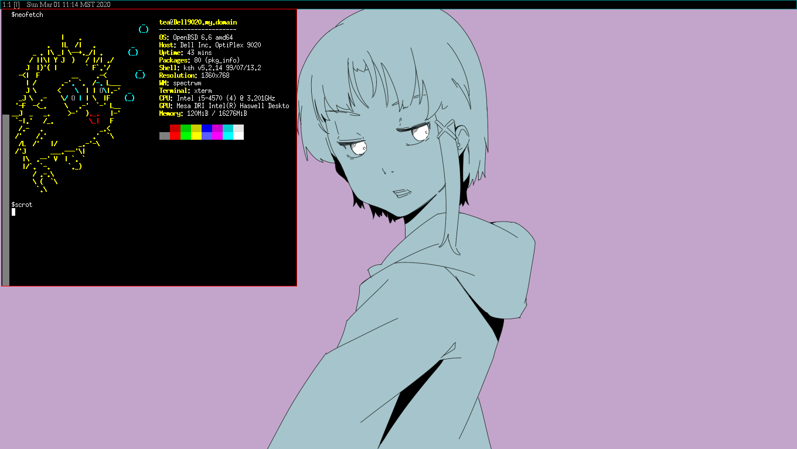

# dotfiles

A simple rice for my Dell Optiplex 9020. _(This is a work in progress)_

* `OS` - OpenBSD ( switching to debian currently )
* `Window Manager` - Spectrwm
* `Terminal Emulator` - XTerm
* `File Manager` - Xfe
* `Text Editor` - Emacs
* `Screen locker` - slock

## Screenshot

