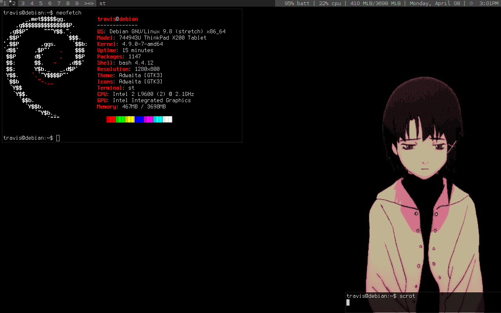

# dotfiles

A simple rice for my Dell Optiplex 9020. _(This is a work in progress)_

* `OS` - ElementaryOS or Debian
* `Window Manager` - Gala or Spectrwm
* `Terminal Emulator` - tilix
* `File Manager` - Xfe
* `Text Editor` - Emacs/jmacs(JOE flavour)

## Setup
```bash
$ git clone https://github.com/teaskittle/dotfiles.git
$ cd dotfiles
$ sudo sh install.sh
$ rm install.sh
$ stow *
```

## Screenshots ( Old )
  

